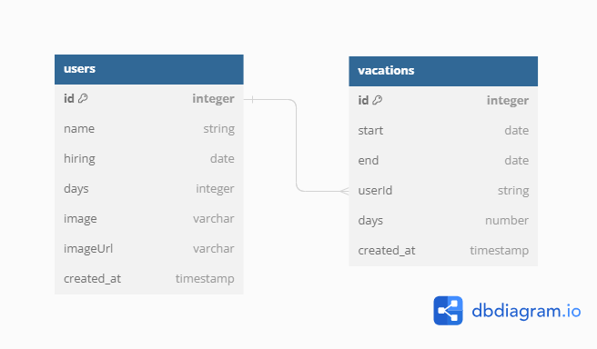

# Custom project about test

## First the data-base schema:



# Setup to test:

## install backend dependencies:

```cd backend && npm install && npm run dev```

## install frontend dependencies:

```cd frontend && npm install && npm start```

# deploy configuration:

